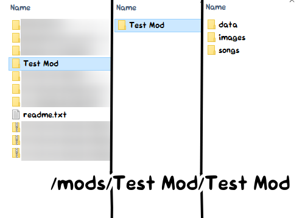
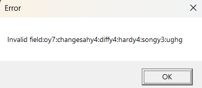

# Troubleshooting

## Black screen

This usually means the game failed to start. The reasons for this could be:

- Non-ASCII characters on the file path (example: `C:\Users\Niña\`)
- File path being too long
- Running the game inside an archive (like `.zip` files) or on a cloud folder (like Onedrive)

The solution is to move the folder somewhere else on the disk.

## Mod refuses to load

Double check your mod folder.

If it looks like this,

then enter that folder and move its contents up a level (place everything on the right to the middle).

## No audio
You probably muted the game. Hit `0` or `+` on your keyboard.

## Invalid field error
Some players might have found out that after a song, the game crashes with this error:

This is a save data error in which saves from Legacy (v0.1) are not recognized in v1.0. The fix is to wipe the save in Options > Miscellaneous > Reset save data.

If you are unable to reset it in the engine, you may instead delete the save yourself in your file manager.

The folder to be deleted is 
- Windows: `%AppData%/CodenameEngine`
- Mac: `Users/[your user]/Library/Application Support/CodenameEngine`
- Linux: `/.local/share/CodenameEngine`

## Modding
### Notes only on the left side of the screen

Change the strumline X position of the second strumline to be 0.75 in the Chart Editor. New strumlines use the X position of 0.25 by default.

### Setting a sprite's `velocity` / `acceleration` does nothing

If you had set this property using the `<property />` tag in the stage XML, you need to set `sprite.moves` to `true`.

This field is `false` by default for optimization reasons, since it would be wasteful if it runs on stationary sprites.

### Character / stage editor is buggy

Every editor except for the Chart Editor is buggy and unfinished. It's better that you manually edit the XML in the meantime.

### Strum rotation also moves notes

Set `strum.noteAngle` to 0.

### Atlas animations not working

This is caused by multiple reasons, but the most common one is that you're using `sprite.animation.play("anim")` as opposed to `sprite.playAnim("anim")`. If you're using the raw `FlxAnimate` class then use `sprite.anim.play("anim")` instead.

### `stage` variable not working

This happens in stage scripts. The issue is that you have a sprite with the name "stage" which causes conflicts. 

To fix this, rename that sprite to something else.
