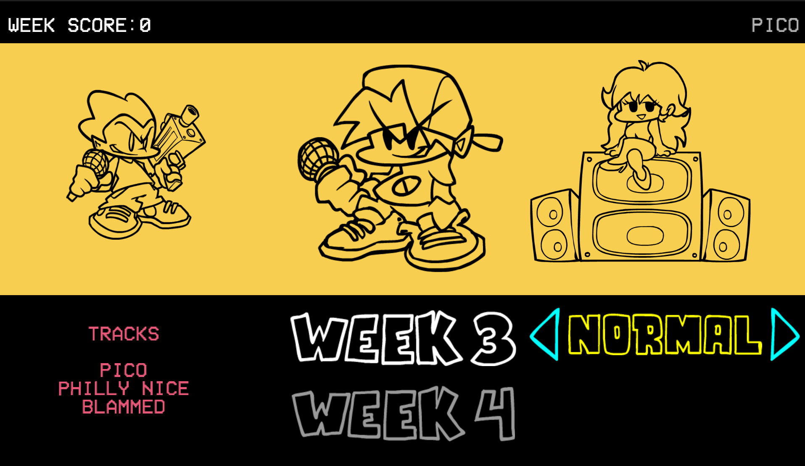
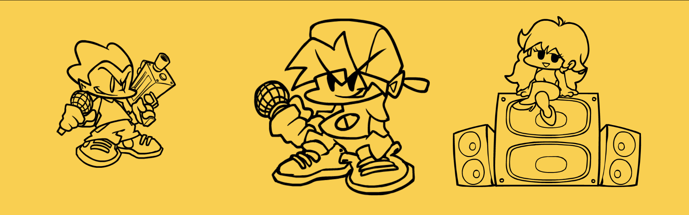
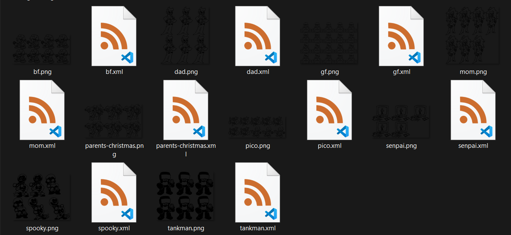
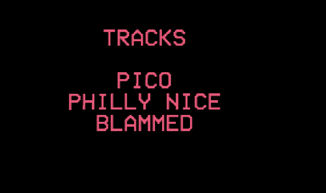

# Making Weeks

## <h2 id="week-xml" sidebar="Week.xml">Creating the Week XML</h2>

Week XMLs go in `./data/weeks/weeks/` (yes, two "weeks" folders). Here's a complete example from Week 3:

```xml
<week name="PICO" chars="pico,bf,gf" sprite="week3">
	<song>Pico</song>
	<song>Philly Nice</song>
	<song>Blammed</song>
</week>
```
<div style="display: flex; justify-content: center;">
    
</div>

Let's break down what each part does:

### The Week Tag

```xml
<week name="PICO" chars="pico,bf,gf" sprite="week3">
```

This is the main container for your week. Here's what each attribute does:

**`name`** - The title displayed in Story Mode (usually top-right corner)
- Example: `name="PICO"` shows "PICO" as the week title
- Can be anything you want: `name="MY COOL WEEK"`
<div style="display: flex; justify-content: center;">
    
</div>

**`chars`** - The characters shown when hovering over the week
- Format: `opponent,boyfriend,girlfriend` (no spaces!)
- Location: `./images/menus/storymenu/characters/`
- Example: `chars="pico,bf,gf"`
- These should match your character XML filenames
<div style="display: flex; justify-content: center; gap: 15px; flex-wrap: wrap;">
    
    
</div>

**`sprite`** (optional) - The week button image
- Location: `./images/menus/storymenu/weeks/`
- Example: `sprite="week3"` looks for `week3.png` in that folder
- If not specified, it uses the XML filename
<div style="display: flex; justify-content: center;">
    
</div>

### Adding Songs

Songs are added using `<song>` tags inside the week:

```xml
<song>Pico</song>
<song>Philly Nice</song>
<song>Blammed</song>
```
<div style="display: flex; justify-content: center;">
    
</div>

**Important:** 
- Song names should match your folder names in `./songs/`
- Order matters! They'll play in the order you list them
- Song names are case-sensitive

### Example: Complete Custom Week

Here's a full example for a custom week:

```xml
<week name="MY WEEK" chars="my-opponent,bf,gf" sprite="myweek">
	<song>Song One</song>
	<song>Song Two</song>
	<song>Final Song</song>
	<difficulty name="Easy"/>
	<difficulty name="Normal"/>
	<difficulty name="Hard"/>
</week>
```

Save this as `./data/weeks/weeks/myweek.xml`

## <h2 id="week-diff-node" sidebar="Week Difficulties">Setting Up Difficulties</h2>

By default, weeks use Easy/Normal/Hard. You can customize this with `<difficulty>` tags:

```xml
<difficulty name="Easy"/>
<difficulty name="Normal"/>
<difficulty name="Hard"/>
<difficulty name="Erect"/>
<difficulty name="Nightmare"/>
```

This gives your week 5 difficulty options instead of the default 3.

### Custom Difficulties

You can create completely custom difficulties:

```xml
<difficulty name="Baby"/>
<difficulty name="Neo"/>
<difficulty name="Flip"/>
```

For custom difficulties, you need to add the difficulty icon:
- Location: `./images/menus/storymenu/difficulties/`
- Name format: lowercase difficulty name
- Example: `chill.png`, `intense.png`, `impossible.png`
<div style="display: flex; justify-content: center;">
    
</div>

## <h2 id="week-sorting" sidebar="Organizing Weeks">Organizing Week Order (weeks.txt)</h2>

By default, weeks appear in alphabetical order. To control the order, create a `weeks.txt` file in `./data/weeks/`:

```
week1
myweek
week3
tutorial
```

This makes weeks appear in that exact order in Story Mode.

**Tips:**
- One week filename per line
- Use `#` for comments: `# This is a comment`
- Only include weeks you want to appear
- Order from top to bottom

Example with comments:

```
# Base game weeks
week1
week2

# My custom weeks
myweek
another-week

# Secret week (unlocked later)
# secret-week
```

## <h2 id="week-checklist" sidebar="Checklist">Quick Checklist</h2>

Before your week works, make sure you have:

- [ ] Week XML created in `./data/weeks/weeks/yourweek.xml`
- [ ] All songs exist in `./songs/` with their folders
- [ ] Week sprite exists at `./images/menus/storymenu/weeks/yourweek.png`
- [ ] Character XMLs exist in `./data/characters/`
- [ ] Character sprites exist in `./images/characters/`
- [ ] Difficulty icons (if using custom difficulties)
- [ ] Added your week to `weeks.txt` (optional, for ordering)

## Common Issues

**Week doesn't appear:**
- Check that the XML filename matches what's in `weeks.txt`
- Make sure the XML is in `./data/weeks/weeks/` not just `./data/weeks/`

**Characters don't show:**
- Verify character names in `chars=""` match your character XML files
- Remember: no spaces in the `chars` list!

**Songs don't load:**
- Song names must match folder names in `./songs/`
- Check for typos and case sensitivity

**Week sprite missing:**
- Default location is `./images/menus/storymenu/weeks/`
- PNG format required
- If not specified in XML, it uses the XML filename

---

That's it! You now know how to create custom weeks.